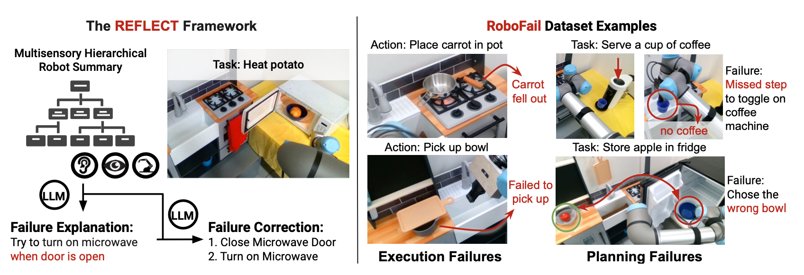
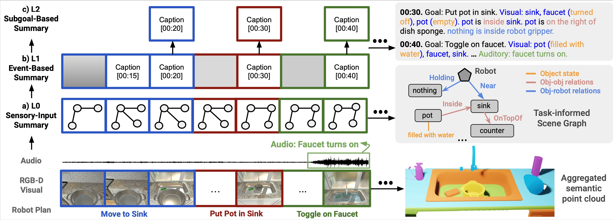
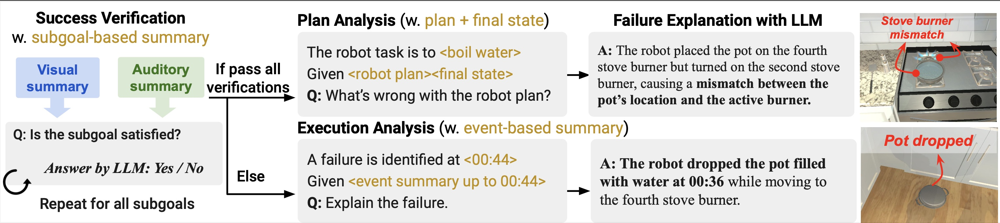
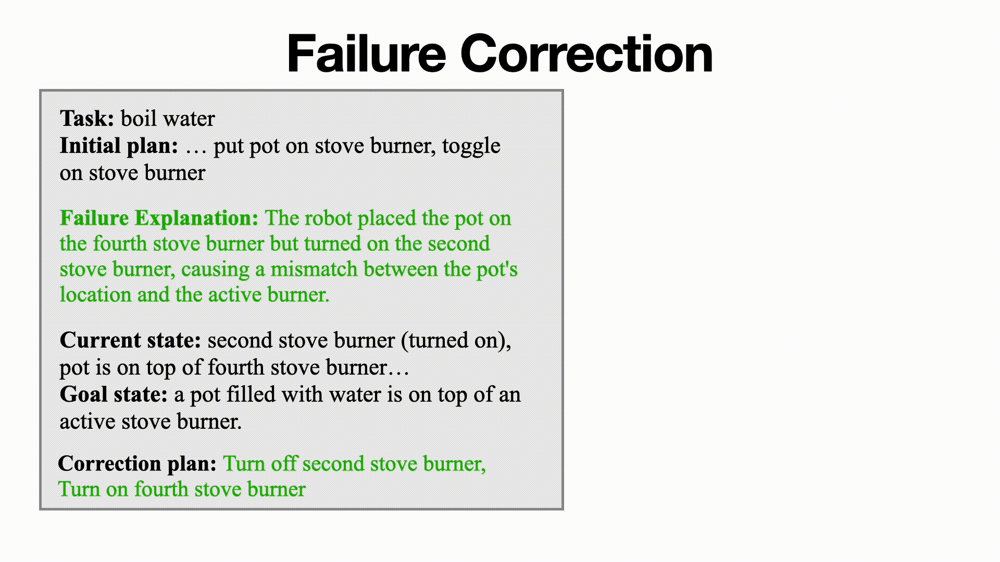

# REFLECT: Summarizing Robot Experiences for Failure Explanation and Correction
#### [Zeyi Liu*](https://lzylucy.github.io/), [Arpit Bahety*](https://arpitrf.github.io/), [Shuran Song](https://shurans.github.io/)

_Columbia University in the City of New York_


[Project Page](https://robot-reflect.github.io/) | [arXiV](https://arxiv.org/abs/2306.15724) | [Summary Video](https://www.youtube.com/watch?v=Proiua4NNTk) | [Dataset](https://www.cs.columbia.edu/~liuzeyi/reflect_data)

---
REFLECT is a framework that that leverages Large Language Models (LLMs) for robot failure explanation and correction, based on a summary of robot past experiences generated from multimodal sensory data. The framework is able to tackle both execution and planning failures across a veriety of tasks.



## Method
### 1. Hierarchical Summary of Robot Experiences

**Hierarchical Robot Summary** is composed of: a) a sensory-input summary that converts multi-sensory robot data (RGB-D, sound, robot states) into task-informed scene graphs and audio summary; b) an event-based summary that generates captions for key event frames; c) a subgoal-based summary that contains the end frame of each subgoal.

### 2. Progressive Failure Explanation with LLM

**Progressive Failure Explanation** verifies success for each subgoal. If a subgoal fails, the algorithm enters the *execution analysis* stage for detailed explanation on the execution. If all subgoals are satisfied, the algorithm enters *planning analysis* stage to check errors in the robot plan.

### 3. Failure Correction Planner


The **failure correction planner** generates an executable plan for the robot to recover from the failure and complete the task by taking in the task description, the original robot plan, the failure explanation, the final state of the original execution, and the expected goal state.


## Codebase
To get started, create a conda environment from the provided env.yml file:
```
conda env create -f env.yml
conda activate reflect_env
python -m pip install git+https://github.com/openai/CLIP.git
```

The dependencies have been tested on `Ubuntu 20.04.6 LTS, Python 3.9.13`.
We provide a [demo colab](https://github.com/columbia-ai-robotics/reflect/blob/main/demo.ipynb) that shows how one can generate failure data in the AI2THOR simulation and use the REFLECT framework to analyze and correct the failures.

Issues or pull requests are welcome!

## Extensions
Here are few suggestions for extending the framework:
1. Generate more failure scenarios (more tasks, more scenes, more failure types) in either simulation or real world.
2. Improve the current perception module by integrating latest vision/audio models that could increase accuracy or capture more low-level information about the environment.
- [Object detection] You may replace the ground truth object detection obtained from simulation with your own object detector [here](https://github.com/columbia-ai-robotics/reflect/blob/5736f88cade931bfcf670df82e38580d9c538771/main/get_local_sg.py#L38).
- [Object state] The codebase supports ground truth object states obtained from simulation and state detection using [CLIP](https://github.com/openai/CLIP). You may replace it with your own method [here](https://github.com/columbia-ai-robotics/reflect/blob/5736f88cade931bfcf670df82e38580d9c538771/main/scene_graph.py#L291).
- [Spatial relations] The codebase uses heuristics on object point clouds to compute inter-object spatial relations. You may replace it with your own method [here](https://github.com/columbia-ai-robotics/reflect/blob/5736f88cade931bfcf670df82e38580d9c538771/main/scene_graph.py#L246).
- [Audio] The codebase uses [WAV2CLIP](https://github.com/descriptinc/lyrebird-wav2clip) for audio detection. You may replace it with your own model [here](https://github.com/columbia-ai-robotics/reflect/blob/main/main/audio.py).
3. Integrate the framework with an existing policy.
4. More applications of the robot experience summary, such as safety or efficiency analysis of robot behaviors, or for human-robot collaboration.

Feel free to contact [Zeyi](https://lzylucy.github.io/) at `liuzeyi [at] stanford [dot] edu` if you have ideas to extend the framework or applying it on new tasks!

## Acknowledgement
Some functions of this codebase are adapted from the codebase of [Language Models as Zero-Shot Planners](https://github.com/huangwl18/language-planner) by Huang et.al and [Socratic Models](https://github.com/google-research/google-research/tree/master/socraticmodels) by Zeng et.al.

## Citation
If you find this codebase useful, feel free to cite our work!
<div style="display:flex;">
<div>

```bibtex
@article{liu2023reflect,
  title={REFLECT: Summarizing Robot Experiences for Failure Explanation and Correction},
  author={Liu, Zeyi and Bahety, Arpit and Song, Shuran},
  journal={arXiv preprint arXiv:2306.15724},
  year={2023}
}
```
